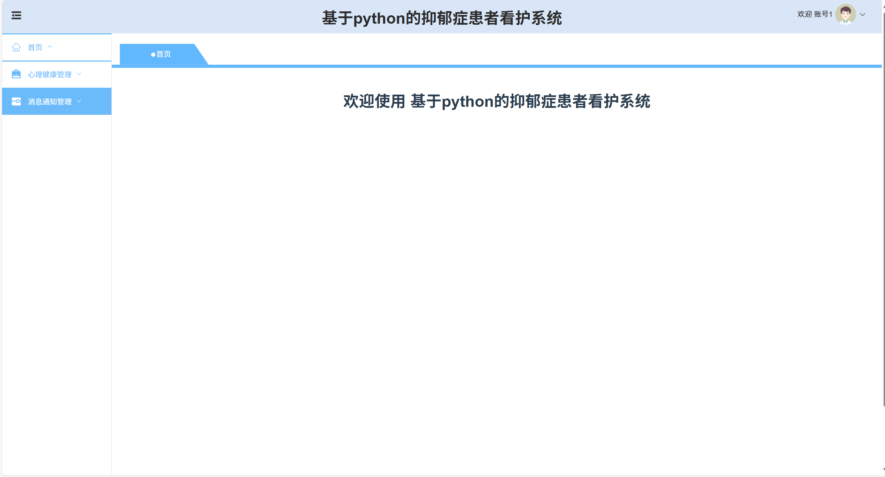

# python107
python107基于Python+Django的抑郁症患者看护系统（Vue3）
 
## 源码问题查看主页咨询

### 一、关键词
抑郁症患者监测管理系统，抑郁症患者健康监护系统，抑郁症患者照护服务系统

### 二、作品包含
源码+数据库+全套环境和工具资源+本地部署教程

### 三、项目技术
前端技术：Html、Css、Js、Vue3.0、Element-ui
后端技术：Python3.7、Django2.0

### 四、运行环境（以下版本亲测，其他版本兼容性请自行测试）
开发工具：PyCharm + VSCODE

数据库：MySQL5.7（最低要5.7版本）

数据库管理工具：Navicat10+

Python：Python3.7

前端Nodejs：16

浏览器：谷歌浏览器

### 五、项目介绍
项目编号：python107

抑郁症患者看护系统主要用于、辅助记录病情变化，并为患者、家属及医护人员提供干预建议与沟通支持，助力提升抑郁症照护的及时性与专业性。
首页：展示患者总数、性别及年龄分布等整体数据。
心理健康管理：提供心理健康相关内容的查看与管理功能。
患者管理：支持患者信息的新增、查看、修改和删除等操作。
消息通知管理：可进行消息通知的新增、查看、修改和删除等管理。

### 六、运行截图

 
